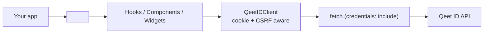

# qeet-id-react

[](package.json)
[](LICENSE)

React hooks and prebuilt components for [Qeet ID](https://qeet.in) — the passkeys-first identity platform. One provider, headless hooks for full control (`useAuth`, `useUser`, `useSignIn`, `usePasskeys`, ...), and prebuilt drop-in UI for when you don't want to build your own (`<SignInButton/>`, `<UserButton/>`, `<SignIn/>`, `<UserProfile/>`) — cookie-based, WebAuthn/passkeys built in, zero third-party runtime dependencies beyond React itself.

```tsx
import { QeetIDProvider, SignedIn, SignedOut, SignInButton, UserButton, useUser } from "@qeet-id/react";

function App() {
  return (
    <QeetIDProvider loginUrl="/api/auth/login" logoutUrl="/api/auth/logout">
      <SignedIn><Dashboard /></SignedIn>
      <SignedOut><SignInButton /></SignedOut>
    </QeetIDProvider>
  );
}
```

New to Qeet ID? Read [Concepts](#concepts) first — this SDK is the browser-side half of the story; the server-side half (managing users, roles, verifying sessions) is [`@qeet-id/node`](https://github.com/qeetgroup/qeet-id-node).

---

## Table of contents

- [Concepts](#concepts)
- [Requirements](#requirements)
- [Installation](#installation)
- [Quick start](#quick-start)
- [Two provider modes: redirect vs. embedded](#two-provider-modes-redirect-vs-embedded)
- [Resource reference](#resource-reference)
- [Core concepts, in code](#core-concepts-in-code)
  - [Headless hooks](#headless-hooks)
  - [Prebuilt components](#prebuilt-components)
  - [Passkeys / WebAuthn](#passkeys--webauthn)
  - [Appearance / theming](#appearance--theming)
  - [Server-side hydration (SSR)](#server-side-hydration-ssr)
- [Architecture](#architecture)
- [Examples](#examples)
- [Documentation](#documentation)
- [FAQ](#faq)
- [Versioning and compatibility](#versioning-and-compatibility)
- [Contributing](#contributing)
- [Security](#security)
- [Support](#support)
- [License](#license)

## Concepts

| Term | What it means here |
|---|---|
| **Redirect mode** | `<QeetIDProvider>` with no `apiUrl` — `<SignInButton>` etc. navigate the whole browser to your own hosted-login routes. Simplest integration; you don't build a sign-in page at all. |
| **Embedded mode** | `<QeetIDProvider apiUrl="...">` — hooks and prebuilt forms (`<SignIn/>`, `<SignUp/>`) drive authentication directly against the API, no redirect. You render the auth UI inline in your own app. |
| **Session cookie** | Qeet ID sets an HttpOnly cookie on sign-in — invisible to JavaScript by design, so this SDK never reads or stores it. Every request just uses `credentials: "include"`. |
| **CSRF token** | A second, JS-readable cookie the backend issues; this SDK echoes it as a header on every mutating request automatically — you never handle it yourself. |
| **Passkey / WebAuthn** | A passwordless credential backed by your device's authenticator (Face ID, Windows Hello, a hardware key). `usePasskeys`/`<UserProfile/>` handle the ceremony via the browser's native WebAuthn API. |

## Requirements

- **Node.js 18.17+** for tooling; **React 18 or 19** as a peer dependency (not bundled).
- A Qeet ID account and, for redirect mode, your own hosted-login routes (or [`@qeet-id/nextjs`](https://github.com/qeetgroup/qeet-id-nextjs), which provides them).

## Installation

```bash
npm install @qeet-id/react
# or: pnpm add @qeet-id/react / yarn add @qeet-id/react
```

## Quick start

```tsx
// app.tsx — redirect mode: no apiUrl, points at your own hosted-login routes.
import { QeetIDProvider, SignedIn, SignedOut, SignInButton, UserButton, useUser } from "@qeet-id/react";

export default function App() {
  return (
    <QeetIDProvider loginUrl="/api/auth/login" logoutUrl="/api/auth/logout" signUpUrl="/api/auth/sign-up">
      <header>
        <UserButton />
      </header>
      <SignedIn>
        <Dashboard />
      </SignedIn>
      <SignedOut>
        <SignInButton>Sign in to continue</SignInButton>
      </SignedOut>
    </QeetIDProvider>
  );
}

function Dashboard() {
  const { user } = useUser();
  return <p>Welcome back, {user?.displayName ?? user?.email}.</p>;
}
```

## Two provider modes: redirect vs. embedded

| | Redirect mode | Embedded mode |
|---|---|---|
| `<QeetIDProvider>` prop | no `apiUrl` | `apiUrl="https://api.id.qeet.in"` |
| `<SignInButton>`/`<SignUpButton>`/`<SignOutButton>` | Navigate to `loginUrl`/`signUpUrl`/`logoutUrl` | Same — these always just navigate |
| `<SignIn/>`/`<SignUp/>` widget forms | Not usable (no client to drive them) | Drive auth directly against the API, no redirect |
| `useSignIn`/`useSignUp`/`usePasskeys`/`useSession` | Throw `"requires apiUrl on <QeetIDProvider>"` | Work normally |
| `useAuth`/`useUser`/`<SignedIn>`/`<SignedOut>` | Read `initialState` (compute it server-side) | Same — these never need `apiUrl` |

Pick redirect mode if you already have (or are fine building) a hosted login page. Pick embedded mode if you want Qeet ID's auth UI to render inline in your app, no full-page navigation.

## Resource reference

<details open>
<summary><strong>Hooks — authentication</strong></summary>

| Hook | Does |
|---|---|
| `useAuth` | Session identity (`isAuthenticated`, `userId`, `tenantId`) — no profile fetch |
| `useSession` | List/revoke the current user's active sessions |
| `useSignIn` | Email/password sign-in with an MFA step |
| `useSignUp` | New-account registration |
| `useSignOut` | Clears the session in embedded mode |
| `usePasskeys` | List/register/remove WebAuthn passkeys |
| `useMFA` | Standalone step-up MFA verification (outside the sign-in flow) |

</details>

<details open>
<summary><strong>Hooks — identity</strong></summary>

| Hook | Does |
|---|---|
| `useUser` | The signed-in user's profile |
| `useOrganization` | The active organization (tenant) + `setActive` to switch |
| `useOrganizationList` | The current user's own tenant membership |

</details>

<details open>
<summary><strong>Components</strong></summary>

| Component | Renders |
|---|---|
| `<SignedIn>`/`<SignedOut>` | Conditional children based on auth state |
| `<SignInButton>`/`<SignUpButton>`/`<SignOutButton>` | Unstyled redirect triggers |
| `<UserButton>` | Avatar trigger + dropdown (name, email, sign out) |
| `<SessionStatus>` | List of active sessions with a revoke action |
| `<RequireAuth>` | Renders `children` if signed in, else `fallback` |
| `<Loading>`/`<Spinner>`/`<ErrorBoundary>` | Small framework-agnostic UI primitives |

</details>

<details open>
<summary><strong>Widgets</strong> (full inline UI, not just triggers)</summary>

| Component | Renders |
|---|---|
| `<SignIn/>` | Full email/password (+ MFA step) sign-in form |
| `<SignUp/>` | Full registration form |
| `<UserProfile/>` | Profile + passkeys + active-sessions management panel |
| `<OrganizationSwitcher/>` | Dropdown to switch active tenant |
| `<OrganizationProfile/>` | Read-only active-organization display |
| `<CreateOrganization/>` | New-organization form shell (see [FAQ](#faq)) |

</details>

## Core concepts, in code

### Headless hooks

Every hook works with or without the prebuilt components — build your own UI entirely from these if you want full control:

```tsx
function CustomSignIn() {
  const { status, signIn } = useSignIn();
  const [email, setEmail] = useState("");
  const [password, setPassword] = useState("");

  return (
    <form onSubmit={(e) => { e.preventDefault(); signIn({ email, password }); }}>
      <input value={email} onChange={(e) => setEmail(e.target.value)} />
      <input type="password" value={password} onChange={(e) => setPassword(e.target.value)} />
      <button disabled={status.step === "loading"}>Sign in</button>
      {status.step === "error" && <p>{status.error}</p>}
    </form>
  );
}
```

Flow hooks (`useSignIn`, `useSignUp`, `useMFA`, `useSignOut`) never throw past their own boundary — every failure is caught into `status.error`, so you render from `status`, not `try`/`catch`.

### Prebuilt components

For teams that don't want to build a sign-in form or account menu from scratch:

```tsx
<SignInButton className="btn-primary">Sign in</SignInButton>
<UserButton menuItems={<a href="/billing">Billing</a>} />
<SignIn onSuccess={() => router.push("/dashboard")} onSignUp={() => router.push("/sign-up")} />
```

None of these are required — see [ADR-0002](docs/design-decisions/) if you're deciding whether to use them or build your own from the hooks.

### Passkeys / WebAuthn

```tsx
function PasskeySettings() {
  const { passkeys, register, remove } = usePasskeys();
  return (
    <>
      <button onClick={register}>Add a passkey</button>
      <ul>
        {passkeys.map((pk) => (
          <li key={pk.id}>
            {pk.name ?? pk.id} <button onClick={() => remove(pk.id)}>Remove</button>
          </li>
        ))}
      </ul>
    </>
  );
}
```

`isWebAuthnSupported()` is available to hide passkey UI entirely on browsers that can't perform the ceremony.

### Appearance / theming

Every widget accepts an `appearance` prop (also settable once on `<QeetIDProvider appearance={...}>`):

```tsx
<QeetIDProvider
  apiUrl="https://api.id.qeet.in"
  appearance={{
    variables: { colorPrimary: "#6366f1", borderRadius: "12px" },
    elements: { buttonPrimary: "my-app-button", card: "my-app-card" },
  }}
>
  <App />
</QeetIDProvider>
```

`variables` map to `--qeetid-*` CSS custom properties; `elements` supply a `className` per named slot, merged onto the internal markup — restyle without forking the component.

### Server-side hydration (SSR)

Pass server-computed auth state so the client renders correctly on first paint, without waiting on a round trip:

```tsx
// e.g. a Next.js Server Component reading the session cookie server-side
<QeetIDProvider initialState={{ isAuthenticated: true, userId, tenantId }}>
  <App />
</QeetIDProvider>
```

## Architecture



See [docs/architecture/ARCHITECTURE.md](docs/architecture/ARCHITECTURE.md) for the two-provider-mode design, the appearance system, and why the session token never touches this code; [docs/design-decisions/](docs/design-decisions/) for the ADRs behind the non-obvious calls.

## Examples

Runnable example snippets live in [`examples/`](./examples):

| Example | Demonstrates |
|---|---|
| [`vite`](./examples/vite) | Plain Vite SPA, redirect mode |
| [`react-router`](./examples/react-router) | Embedded mode with a protected route via `<RequireAuth>` |
| [`tanstack-router`](./examples/tanstack-router) | Same pattern on TanStack Router |
| [`react19`](./examples/react19) | React 19's `useActionState` driving `useSignIn` |
| [`electron`](./examples/electron) | Embedded mode inside an Electron renderer |

## Documentation

- [docs/architecture/ARCHITECTURE.md](./docs/architecture/ARCHITECTURE.md)
- [docs/design-decisions/](./docs/design-decisions/) — ADRs, including why some hooks/components were deliberately **not** built
- [docs/FUTURE.md](./docs/FUTURE.md) — capabilities other CIAM React SDKs have that Qeet ID's backend doesn't support yet

## FAQ

**Why is there no `usePermission`/`useRole`?** The real backend has no session-authenticated "what can I do" endpoint — only the server-side management API (`@qeet-id/node`) can resolve RBAC. See [docs/FUTURE.md](docs/FUTURE.md).

**Why does `<CreateOrganization/>` not actually create anything?** Tenant creation is a management-API operation. The component renders a real form and dispatches a `qeetid:create-organization` event with the entered name — wire that up to your own backend endpoint (which calls `@qeet-id/node`'s `organizations.create`), rather than expecting this browser SDK to do it directly with no credential to do so safely.

**Do I need both `@qeet-id/react` and `@qeet-id/node`?** Usually yes — `@qeet-id/node` on your backend (holds the secret API key, verifies sessions, manages users/roles) and `@qeet-id/react` on your frontend (renders auth UI, drives sign-in). They're complementary, not overlapping.

**Can I use only the hooks and none of the prebuilt components?** Yes — nothing else in this package depends on `SignInButton.tsx`/`UserMenu.tsx`/the widget forms. Build your own UI entirely from `useAuth`, `useSignIn`, `usePasskeys`, etc.

**Does this SDK store my session token anywhere?** No — it's an HttpOnly cookie, invisible to JavaScript by design. This SDK never reads or writes it.

## Versioning and compatibility

Follows [Semantic Versioning](https://semver.org/). Currently **pre-1.0** — see [CHANGELOG.md](./CHANGELOG.md). React 18 and 19 are both supported as peer dependencies.

## Contributing

See [CONTRIBUTING.md](./CONTRIBUTING.md).

## Security

See [SECURITY.md](./SECURITY.md) — please don't open a public issue for security reports.

## Support

- **Bugs / feature requests:** [open an issue](https://github.com/qeetgroup/qeet-id-react/issues)
- **Qeet ID platform questions:** [qeet.in](https://qeet.in)
- **Security reports:** see [SECURITY.md](./SECURITY.md)

## License

[MIT](./LICENSE)
